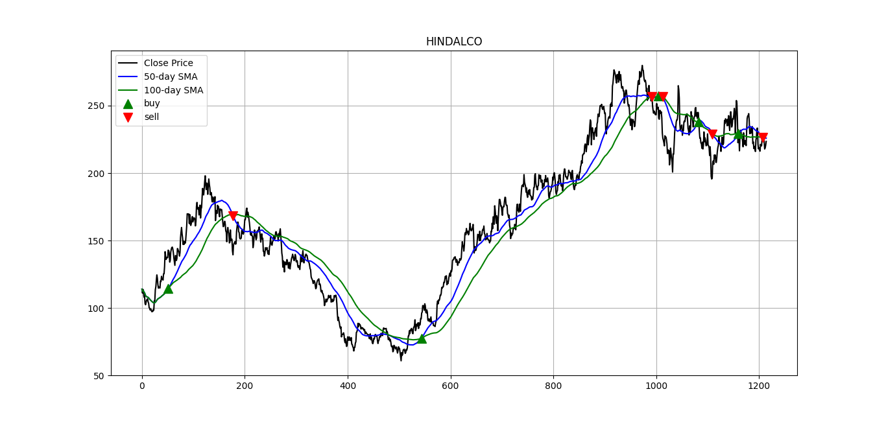

# Stock Analyzer

Analyze instrument ticks using Simple Moving Crossover Strategy to generate buy and sell signals

## Usage

**migrate.py**: Migrate csv data to Postgres DB

```
python3 migrate.py <instrument> -s <addresss> -d <db> -u <user> -p <password>
```

**analyze.py**: Analyze the instrument's ticks and plot signals
```
python3 analyze.py <path_to_csv> -s <addresss> -d <db> -u <user> -p <password>
```

## Results/Performance:

SMA Crossover strategy using 50-day and 100-day moving averages